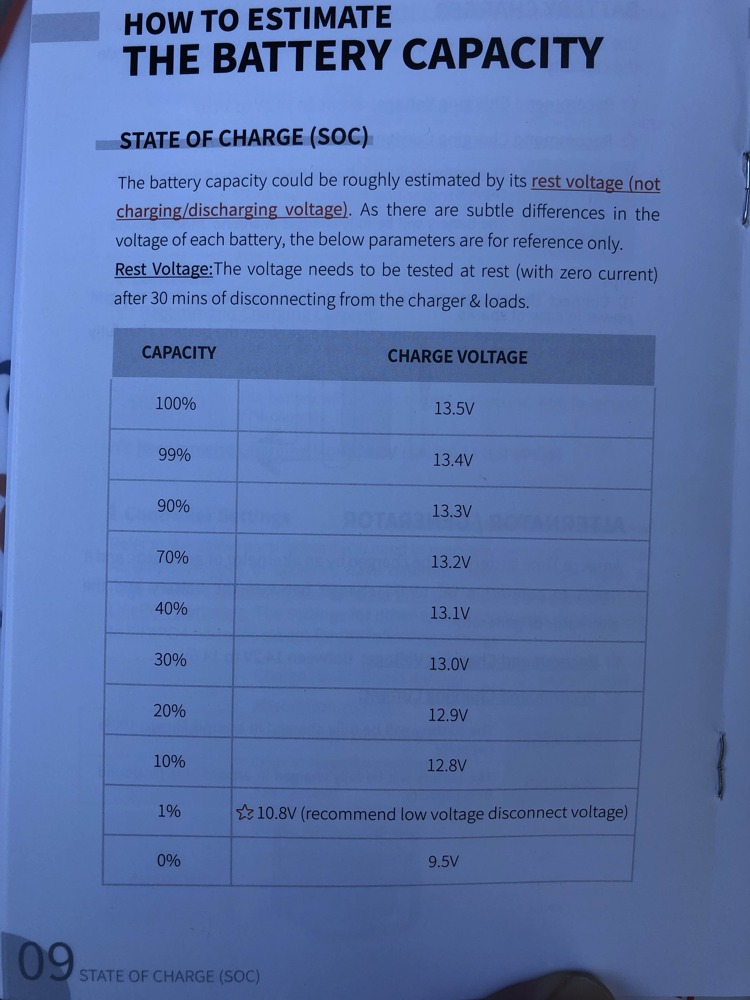
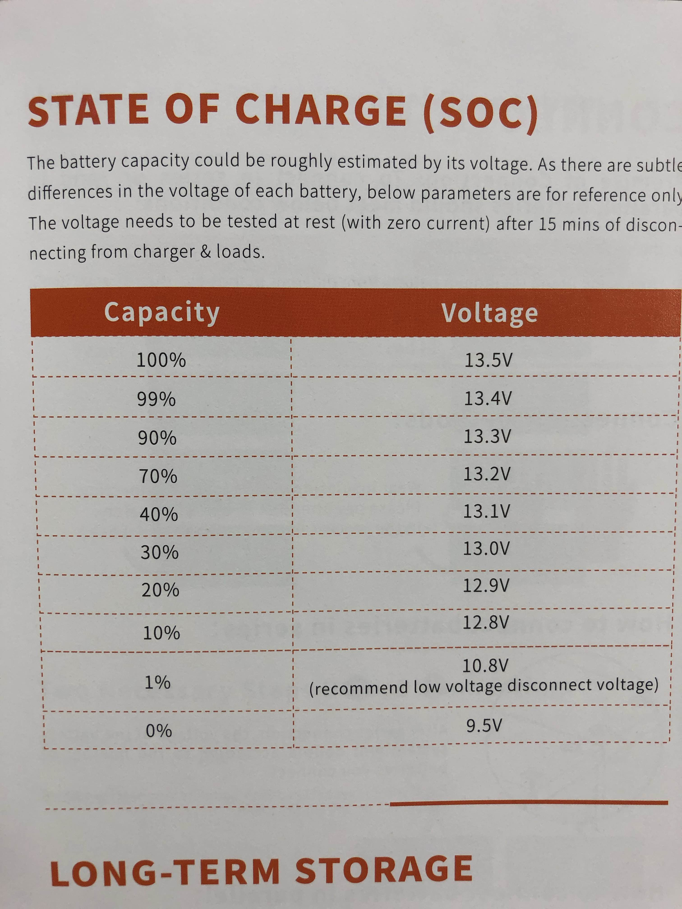

# Electrical

## Batteries

The [AmpereTime](https://amperetime.com) 100 Ah and 200 Ah LiFePo batteries have the same estimated State of Charge values (SOC). The camper is currently using the 200 Ah battery. The AmpereTime battery was recommened by Will Prowse in one of his tear-down videos and on his website, [Mobile Solar Power](https://www.mobile-solarpower.com/lithium-batteries.html).

| Capcity  | Charge Voltage|
| -------- |:-------------
| 100%    | 13.5V |
| 99%     | 13.4V |
| 90%     | 13.3V |
| 70%     | 13.2V |
| 40%     | 13.1V |
| 30%     | 13.0V |
| 20%     | 12.9V |
| 10%     | 12.8V |
| 1%      | 10.8V (recommended low voltage disconnect) |
| 0%      | 9.5V |

* 
* 