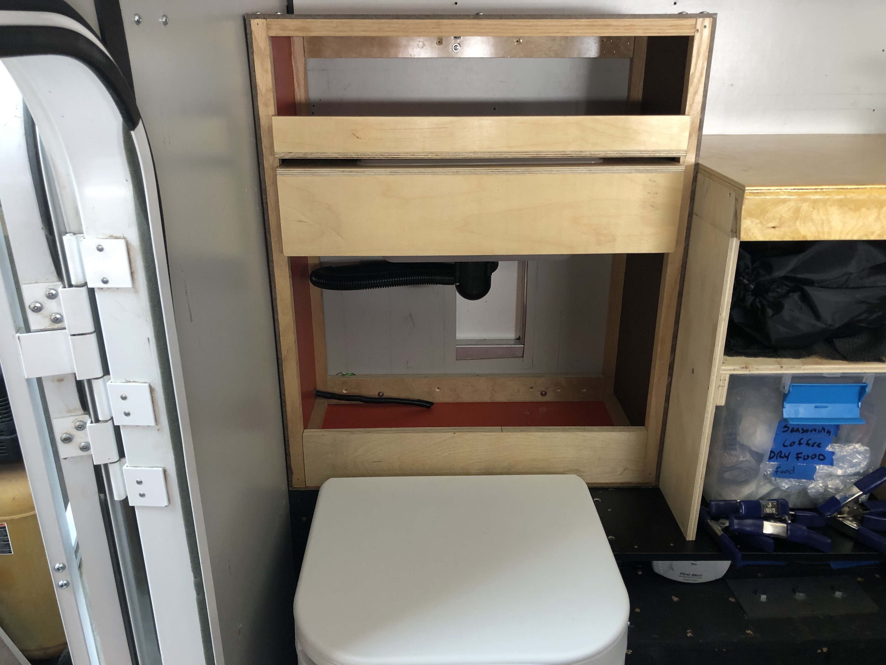
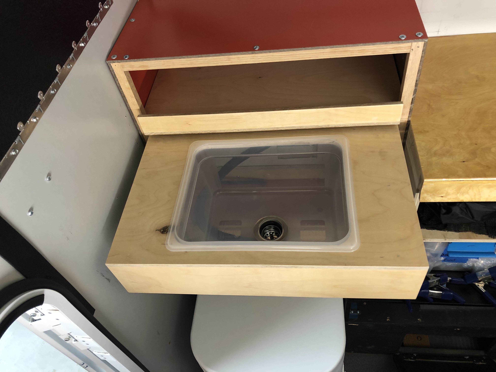

# Ogo Toilet 

* June 2022: Installed [Ogo Composting Toilet](https://ogotoilet.com). The toilet was installed after removing the battery compartment and relocating the battery. A small 12 VDC fan runs continuously to exhaust composting smells. The vent is a 2 inch hole behind the toilet, near the old battery compartment vents.
* September 2022: Installed sink drawer with exterior drain. Sink is a ["food pan"](https://duckduckgo.com/?q=plastic+food+pan&t=ffab&iar=images&iax=images&ia=images) used in comercial kitchens for storage and prep work. A suitable hole was cut in the container to accept the [Camco Flexible Camper Drain Tap with Hose System](https://a.co/d/8bA9wUm). Drawer slides from Home Depot.

### Pics of install: 
* 
* 
* 
* 
* 
* 
* 